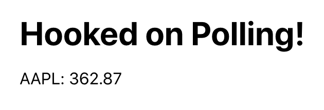

# Hooked on Polling!

_Hooked on Polling_ is a sample application to demonstrate API polling using
React Hooks, specifically `useState` and `useReducer` hooks. The application
polls for Apple's stock price every 30 seconds and displays it as shown below.



## Implementation

At start, the application starts a [global heartbeat](src/App.tsx) which is
managed using `useState`. The heartbeat is triggered every 10 seconds.

[usePolling](src/hooks/usePolling.ts) is the polling hook which listens to the
global heartbeat and triggers a poll every 30 seconds. To do this, it stores the
`lastPollTime` in state managed using `useReducer`. When the current heartbeat
exceeds `lastPollTime + 30 seconds`, `lastPollTime` is reinitialized to the
current heartbeat time, and a new poll is initiated. After receiving a response
from the stock service, the result is also saved in state.

The asynchronous nature of the polling hook necessitates the use of `useReducer`
(vs. `useState`). Given that we need to update `lastPollTime` before the poll
and the results after the poll, `useState` would get us into a race condition,
and we would be polling non-stop hundreds of times a second! You can read the
references below to understand why, but here are the high-level concepts:

-   The `setState()` function of `useState` does not update the state value
    right away. React may batch multiple setState calls into a single update for
    performance.

-   `useEffect` runs after every render. You might find it easier to think that
    effects happen “after render”. If they change state the component depends
    on, the component will re-render. So you have to be very careful about how
    and when to change state.

## Build

Before doing a build, obtain your free API key from
[Financial Modeling Prep](https://financialmodelingprep.com/developer/docs/) and
enter it in /public/env.js. Then follow these steps:

```bash
$ yarn
$ yarn start
```

Now point your browser to http://localhost:3000/. Open the console in Chrome
DevTools to see the 10-second heartbeats and the 30-second polls.

## Test

Execute the following command to run tests in interactively:

```bash
yarn test
```

Execute the following command to run all tests and show test coverage.

```bash
yarn test:coverage
```

## References

-   [State Updates May Be Asynchronous](https://blog.logrocket.com/a-guide-to-usestate-in-react-ecb9952e406c/)
-   [A guide to useState in React](https://blog.logrocket.com/a-guide-to-usestate-in-react-ecb9952e406c/)
-   [Does useEffect run after every render?](https://reactjs.org/docs/hooks-effect.html#example-using-hooks)
-   [A Complete Guide to useEffect](https://overreacted.io/a-complete-guide-to-useeffect/)
